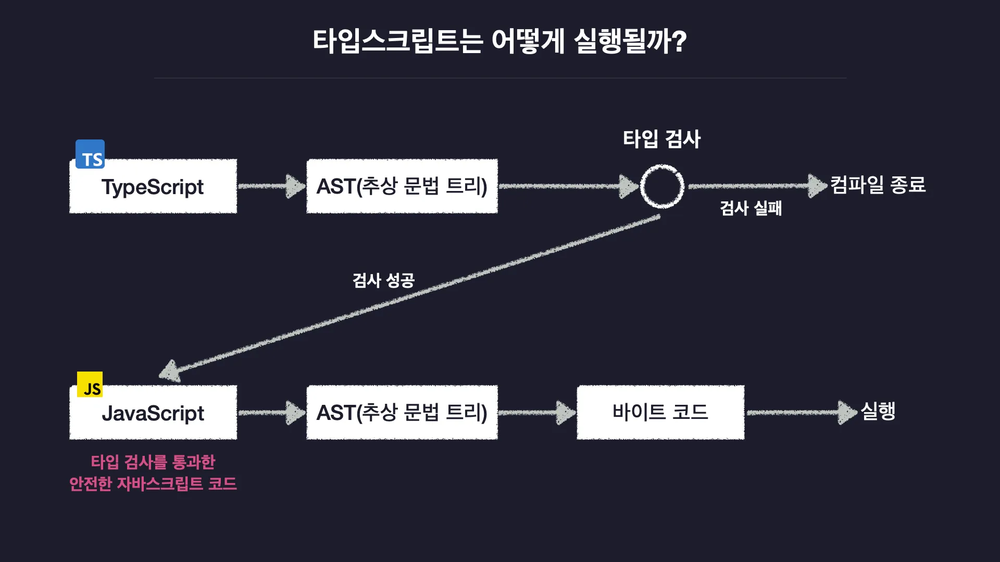

## TypeScript의 탄생 배경

타입스크립트 = 자바스크립트의 확장판
: 자바스크립트를 더 안전하게 사용할 수 있도록 '타입 관련 기능들을 추가한' 언어

자바스크립트는 변수의 타입을 직접 정의할 수 있는 방법이 없다.

근데 굳이 굳이 왜 타입스크립트를 써야하나. 자바스크립트가 너무 잘나가서?

자바스크립트는 아주 쉽고 빠르고 간결하게 작성할 수 있는 것에 중점을 두고 만들어졌는데, node.js 가 등장함 (자바스크립트 런타임)

웹 브라우저에서만 사용할 수 있었던게 어디서든 사용할 수 있게 됨 -> 다양한 프로그램들이 개발됨

근데 자바스크립트가 너무 엄격하지 않음 이 유연함이 버그를 발생시켜 안정성을 떨어뜨림

이러한 문제를 극복하기 위해 안정성을 추가한 언어를 추가 -> 타입스크립트!

자바스크립트를 더 복잡한 상황에서 더 안정적으로 사용하기 위해 타입이라는 안정장치를 추가한 것이다.

1. 자바스크립트의 단점과 타입스크립트
2. 자바스크립트에는 어떤 한계점이 있는가?
3. 이 한계점을 어떻게 극복하는가?

모든 프로그래밍 언어는 타입 시스템을 갖고 있음

이 타입 시스템은 크게 2가지로 나뉜다. 타입을 '언제' 결정하느냐에 따라

1. 정적 타입 시스템 (C, Java, ..)

   - 코드 실행 이전 모든 변수의 타입을 고정적으로 결정
   - but 코드의 양이 넘 늘어남

2. 동적 타입 시스템 (Python, JavaScript, ..)

   - 코드를 실행하고 나서 그때그때마다 유동적으로 결정
   - 변수의 타입이 하나로만 고정되지 않음, 유연함
   - but 에러 발생 가능성

타입스크립트는 동적 + 정적
-> 변수의 타입을 실행 전에 결정, 타입 오류를 실행 전에 검사

모든 변수에 타입을 일일이 지정할 필요 없음 = 점진적 타입 시스템 (Gradual Type System)

-> 안전성, 불편함 해결!

 

## TypeScript의 동작 원리와 이유

프로그래밍 언어의 동작 원리

- 프로그래밍 언어를 컴파일하면 컴퓨터가 읽을 수 있는 기계어로 변환되어 실행됨

컴파일 과정
JavaScript -> AST(추상 문법 트리) -> 바이트 코드 -> 실행

타입스크립트의 컴파일 과정
TypeScript -> AST(추상 문법 트리) -> Type Checking(타입 검사) 성공 시, -> 안전한 JavaScript 코드로 변환

