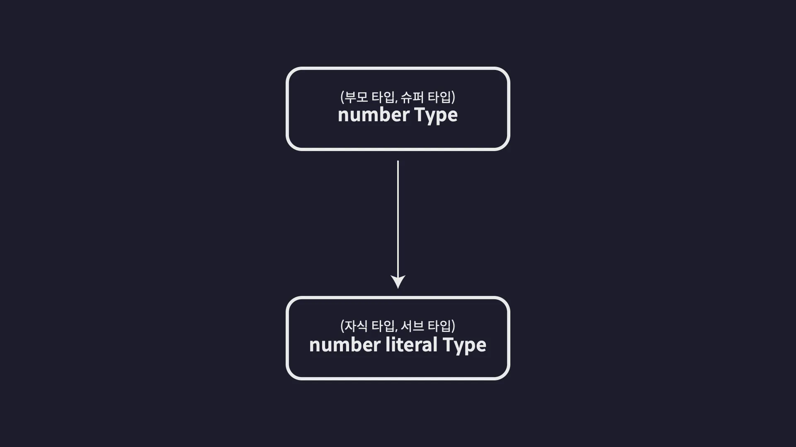
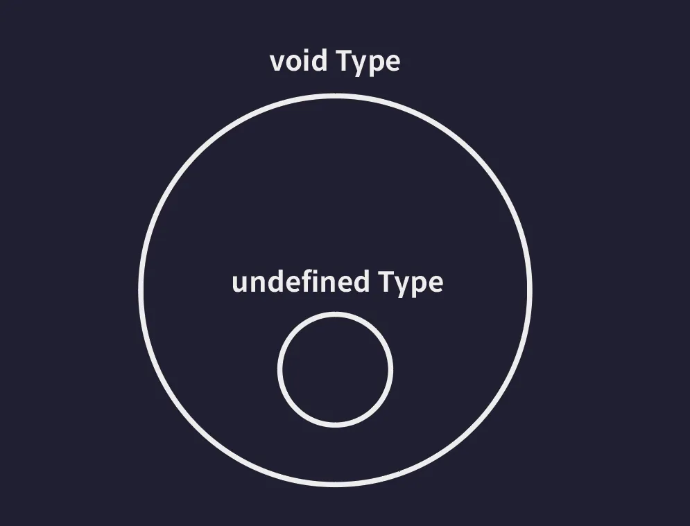

## Section2. 타입스크립트 기본

### Any와 Unknown 타입

#### any 타입

> 타입스크립트에서만 제공되는 특별한 타입으로 타입 검사를 받지 않는 특수한 치트키 타입

- but, **any는 최대한 사용하지 마세요**

  ```ts
  let anyVar: any = 10;
  anyVar = "hello";

  let num: number = 10;
  num = anyVar;
  ```

#### unknown 타입

> any 타입과 비슷하지만 보다 안전한 타입, 오직 값을 저장하는 행위만 할 수 있다.

- 조건문을 이용해 특정 값이 특정 타입임을 보장할 수 있게 되면 해당 값의 타입이 자동으로 바뀜 (타입 좁히기)

  -> 특정 변수가 당장 어떤 값을 받게 될 지 모른다면 any 타입으로 정의하는 것 보단 unknown 타입을 이용하는게 훨씬 안전한 선택

  ```ts
  let unknownVar: unknown;
  unknownVar * 2; // 오류!

  if (typeof unknownVar === "number") {
    // 이 조건이 참이된다면 unknownVar는 number 타입으로 볼 수 있음
    unknownVar * 2;
  }
  ```

<br/>

---

### Void와 Never 타입

#### void

> 아무런 값도 없음을 의미

- 아무런 값도 반환하지 않는 함수의 반환값 타입
  - 타입스크립트 버전이 5.1로 업데이트 되면서 이제는 아무것도 반환하지 않는 함수의 반환값 타입으로 undefined 사용 가능해짐
- void 타입의 변수에는 undefiend 이외의 다른 타입의 값은 담을 수 없다.

  ```ts
  function func2(): void {
    console.log("hello");
  }

  let a: void;
  a = undefined;
  ```

#### never

> 불가능을 의미

- 함수가 어떠한 값도 반환할 수 없는 상황일 때 반환값 타입
- 의도적으로 오류를 발생시키는 함수

<br/>

## Section3. 타입스크립트 이해하기

어떤 기준으로 타입을 정의하고,
<br/>어떤 기준으로 타입들간의 관계를 정의하고,
<br/>어떤 기준으로 타입스크립트 코드의 오류를 검사 하는지
그 원리와 동작 방식을 살펴보는 것

### 타입은 집합이다

> '타입'은 여러 개의 값을 포함하는 '집합' <br/>집합은 동일한 속성을 갖는 여러개의 요소들을 하나의 그룹으로 묶은 단위

- 타입스크립트의 모든 타입들은 집합으로써 서로 포함하고 또 포함되는 이런 관계를 갖는다.

  

<br/>

---

### 타입 호환성

> A와 B 두개의 타입이 존재할 때 A 타입의 값을 B 타입으로 취급해도 괜찮은지 판단하는 것

- 업 캐스팅: 슈퍼타입의 값을 서브타입의 값으로 취급하는 것
- 다운 캐스팅

  ```ts
  let num1: number = 10;
  let num2: 10 = 10;

  num2 = num1; // ❌
  ```

<br/>

---

### 타입 계층도와 함께 기본 타입 살펴보기

#### unknown 타입 (전체 타입)

- 타입 계층도의 최 상단에 위치
- 모든 타입의 슈퍼타입 = 모든 타입의 값을 할당할 수 있다
- 모든 타입은 unknown 타입으로 업캐스팅 할 수 있다.

  ```ts
  let a: unknown = 1; // number -> unknown
  let b: unknown = "hello"; // string -> unknown
  let c: unknown = true; // boolean -> unknown
  let d: unknown = null; // null -> unknown
  let e: unknown = undefined; // undefined -> unknown
  let f: unknown = []; // Array -> unknown
  let g: unknown = {}; // Object -> unknown
  let h: unknown = () => {}; // Function -> unknown
  ```

#### never 타입 (공집합 타입)

- 타입 계층도의 가장 아래에 위치
- 모든 타입의 서브 타입
- never 타입은 모든 타입으로 업캐스팅 할 수 있다

  ```ts
  let neverVar: never;

  let a: number = neverVar; // never -> number
  let b: string = neverVar; // never -> string
  let c: boolean = neverVar; // never -> boolean
  let d: null = neverVar; // never -> null
  let e: undefined = neverVar; // never -> undefined
  let f: [] = neverVar; // never -> Array
  let g: {} = neverVar; // never -> Object
  ```

#### void 타입

- undefined, never 타입의 슈퍼타입이다.
- void 타입에는 undefined, never 이외에 다른 타입의 값을 할당할 수 없다.

  ```ts
  let voidVar: void;

  voidVar = undefined; // undefined -> void (ok)

  let neverVar: never;
  voidVar = neverVar; // never -> void (ok)
  ```

  
